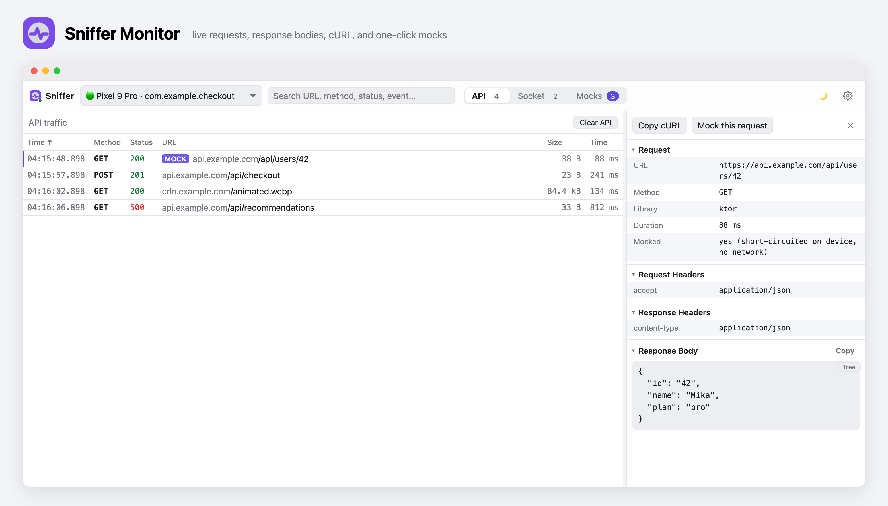

<h1 align="center">Sniffer</h1>

<p align="center">
  <a href="https://github.com/dev-weiqi/sniffer/tags"></a>
  <a href="https://www.npmjs.com/package/@dev-weiqi/sniffer"></a>
  <a href="https://central.sonatype.com/namespace/io.github.dev-weiqi.sniffer"></a>
  <a href="https://github.com/dev-weiqi/sniffer/actions/workflows/ci.yml"></a>
  <a href="LICENSE"></a>
</p>

Sniffer is a Kotlin Multiplatform SDK and local monitor for inspecting and mocking
mobile network traffic while you develop apps.

It supports **OkHttp**, **Ktor Client**, **Socket.IO**, and **Ktor WebSocket**.



It follows the developer workflow that made
[Flipper](https://github.com/facebook/flipper) useful: connect a debug app,
watch traffic live, and change behavior from a desktop UI. Sniffer exists because
our Flipper-based Android setup ran into the
[Android 16 KB page-size migration](https://developer.android.com/guide/practices/page-sizes),
while the upstream Flipper repository is now a public archive/read-only project.
Sniffer keeps the network debugging pieces in a small stack we can maintain.

## Install the monitor

The daemon runs on your dev machine: it serves the browser UI, stores mock
rules, and keeps `adb reverse` alive for Android devices.

**Prerequisites**

- [Node.js](https://nodejs.org) 20+ (npm ships with it)
- `adb` (Android platform-tools) on your PATH, for Android devices only; iOS needs nothing extra

```bash
npm install -g @dev-weiqi/sniffer
```

```bash
sniffer start
```

The UI opens in your browser at [http://localhost:9091](http://localhost:9091).
Or skip the install and run it straight:

```bash
npx @dev-weiqi/sniffer start
```

If port 9091 is taken, Sniffer offers to free it for you. You can also pick
another port:

```bash
PORT=9092 sniffer start
```

By default the daemon binds to `127.0.0.1` only, so it is not exposed to your
network. Android (via `adb reverse`) and the iOS simulator reach it over
`localhost`, so they are unaffected. A **physical iOS/Android device connecting
over Wi-Fi** to your machine's LAN address needs the daemon opened up:

```bash
SNIFFER_BIND=0.0.0.0 sniffer start
```

`SNIFFER_BIND` (daemon: which interface to listen on) is the server-side twin of
the client-side `host` you pass in the app (`Sniffer.start(host = ...)`, which
tells the device where to find the daemon). For Wi-Fi you set both: open the
daemon with `SNIFFER_BIND=0.0.0.0`, and point the app at your machine's LAN IP.

To update an existing install to the latest version:

```bash
npm install -g @dev-weiqi/sniffer@latest
```

Or pin a specific version:

```bash
npm install -g @dev-weiqi/sniffer@0.1.7
```

## Add the SDK

Use `core` plus the transport modules your app actually uses. Add the matching
`-noop` artifacts to release builds so production builds keep the same API with
empty implementations.

Supported client integrations:

| Client | Sniffer artifact |
| --- | --- |
| OkHttp | `io.github.dev-weiqi.sniffer:okhttp` |
| Ktor Client | `io.github.dev-weiqi.sniffer:ktor` |
| Socket.IO | `io.github.dev-weiqi.sniffer:socketio` |
| Ktor WebSocket | `io.github.dev-weiqi.sniffer:ktor-ws` |

```kotlin
val snifferVersion = "0.4.0"

dependencies {
    debugImplementation("io.github.dev-weiqi.sniffer:core:$snifferVersion")
    releaseImplementation("io.github.dev-weiqi.sniffer:core-noop:$snifferVersion")

    debugImplementation("io.github.dev-weiqi.sniffer:okhttp:$snifferVersion")
    releaseImplementation("io.github.dev-weiqi.sniffer:okhttp-noop:$snifferVersion")

    debugImplementation("io.github.dev-weiqi.sniffer:ktor:$snifferVersion")
    releaseImplementation("io.github.dev-weiqi.sniffer:ktor-noop:$snifferVersion")

    debugImplementation("io.github.dev-weiqi.sniffer:socketio:$snifferVersion")
    releaseImplementation("io.github.dev-weiqi.sniffer:socketio-noop:$snifferVersion")

    debugImplementation("io.github.dev-weiqi.sniffer:ktor-ws:$snifferVersion")
    releaseImplementation("io.github.dev-weiqi.sniffer:ktor-ws-noop:$snifferVersion")
}
```

For Kotlin Multiplatform shared code, add the KMP modules you need to
`commonMain`:

```kotlin
commonMain.dependencies {
    implementation("io.github.dev-weiqi.sniffer:core:$snifferVersion")
    implementation("io.github.dev-weiqi.sniffer:ktor:$snifferVersion")
    implementation("io.github.dev-weiqi.sniffer:ktor-ws:$snifferVersion")
}
```

## Start Sniffer

Start the SDK once when the app boots. The SDK reconnects automatically and does
not throw into your app when the daemon is not running.

```kotlin
import dev.weiqi.sniffer.core.Sniffer

class App : Application() {
    override fun onCreate() {
        super.onCreate()
        Sniffer.start(appId = packageName)
    }
}
```

Android devices and emulators reach the daemon through `adb reverse`, so
`localhost:9091` works by default. iOS simulators can also use `localhost`.
For a physical iOS device, pass your Mac's LAN address:

```kotlin
Sniffer.start(appId = "com.example.app", host = "192.168.1.20")
```

Runtime overrides are available when you do not want to rebuild:

```bash
adb shell setprop debug.sniffer.port 9092
adb shell setprop debug.sniffer.host 192.168.1.20
```

## Attach your clients

OkHttp:

```kotlin
import dev.weiqi.sniffer.okhttp.SnifferOkHttp

val okHttp = OkHttpClient.Builder()
    .addInterceptor(SnifferOkHttp.interceptor())
    .build()
```

Ktor client:

```kotlin
import dev.weiqi.sniffer.ktor.SnifferKtor

val ktor = HttpClient(CIO) {
    install(SnifferKtor)
}
```

Socket.IO:

```kotlin
import dev.weiqi.sniffer.socketio.SnifferSocketIO

val raw = IO.socket("https://api.example.com")
val socket = SnifferSocketIO.wrap(raw, "https://api.example.com")

socket.connect()
socket.emit("cart:update", mapOf("sku" to "pro"))
```

Ktor WebSocket: install the plugin once and plain `webSocket` calls are monitored:

```kotlin
import dev.weiqi.sniffer.ktorws.SnifferKtorWs

val ktor = HttpClient(CIO) {
    install(SnifferKtorWs)
    install(WebSockets)
}

val session = ktor.webSocketSession("wss://api.example.com/realtime")
session.send("ping")
```

## Use the UI

Open `http://localhost:9091`, launch your debug app, and select the connected
device.

- **API**: inspect live requests and responses, headers, JSON, images, animated
  WebP responses, copied cURL commands, and mocked entries.
- **Socket**: inspect Socket.IO and WebSocket connections, events, payloads,
  acks, and pushed server-to-client messages.
- **Mocks**: create per-device HTTP response rules, delay-only rules, Socket.IO
  ack rules, WebSocket reply rules, and server-to-client push events.

Rules are sent to the selected device and run inside the SDK. HTTP mocks
short-circuit matched requests before the network. Socket ack rules answer the
client locally. Mock bodies support placeholders such as `${id}` and
`${randomString(length)}`.

## Modules

| Artifact | Use it for |
| --- | --- |
| `io.github.dev-weiqi.sniffer:core` | SDK connection, device identity, mock rule sync |
| `io.github.dev-weiqi.sniffer:okhttp` | OkHttp request/response inspection and HTTP mocks |
| `io.github.dev-weiqi.sniffer:ktor` | Ktor client inspection for Android/iOS/JVM |
| `io.github.dev-weiqi.sniffer:socketio` | Socket.IO event inspection, ack mocks, push events |
| `io.github.dev-weiqi.sniffer:ktor-ws` | Ktor WebSocket frame inspection and reply mocks |

Each artifact has a `-noop` twin with the same API.

## Local Development

From this repository:

```bash
npm run setup
npm start

cd client
./gradlew :sample:installDebug
./gradlew :sample-cmp:installDebug
```

Useful checks:

```bash
cd server/daemon && npm run typecheck
cd server/ui && npm run build
cd client && ./gradlew :core:jvmTest :okhttp:test :sample:compileDebugKotlin
```

More detail: [docs/GUIDE.md](docs/GUIDE.md) and [PROTOCOL.md](PROTOCOL.md).

## Troubleshooting

### "Sniffer is damaged and can't be opened" (macOS)

The desktop dmg from GitHub Releases is not notarized by Apple yet, so
Gatekeeper blocks it after download. Drag `Sniffer.app` into `/Applications`,
then clear the quarantine flag once:

```bash
xattr -d com.apple.quarantine /Applications/Sniffer.app
```

After that it opens normally.
