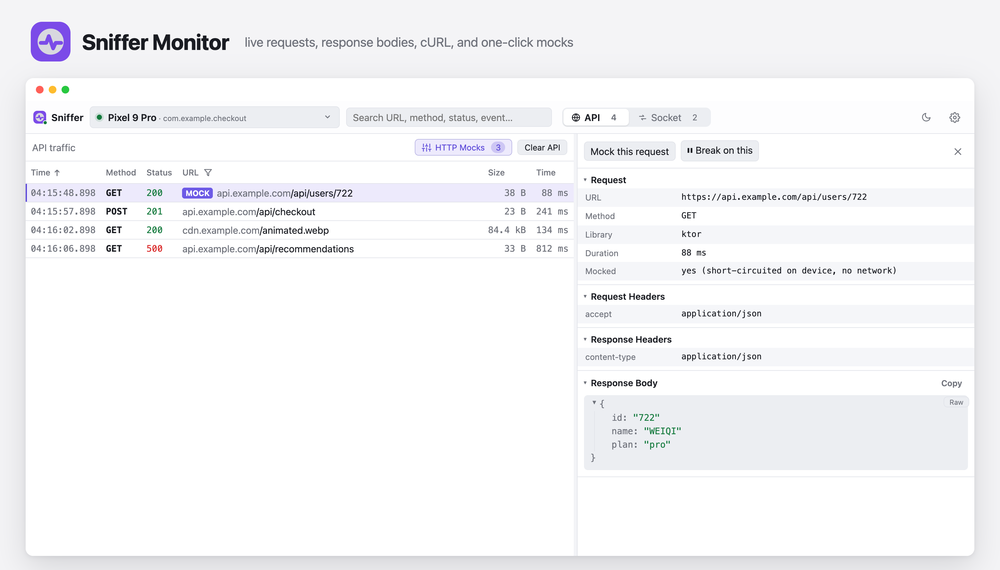

<h1 align="center">Sniffer</h1>

<p align="center">
  <a href="https://github.com/dev-weiqi/sniffer/tags"></a>
  <a href="https://www.npmjs.com/package/@dev-weiqi/sniffer"></a>
  <a href="https://central.sonatype.com/namespace/io.github.dev-weiqi.sniffer"></a>
  <a href="https://github.com/dev-weiqi/sniffer/actions/workflows/ci.yml"></a>
  <a href="LICENSE"></a>
</p>

Sniffer is a Kotlin Multiplatform SDK and local monitor for inspecting and mocking
mobile network traffic during development. It supports **OkHttp**, **Ktor Client**,
**Socket.IO** and **Ktor WebSocket**.



It keeps the [Flipper](https://github.com/facebook/flipper) workflow (connect a debug
app, watch traffic live, change behavior from a desktop UI) after Flipper was archived
and our setup hit the
[Android 16 KB page-size migration](https://developer.android.com/guide/practices/page-sizes).

## Install the monitor

The daemon runs on your dev machine. It serves the browser UI, stores mock rules and
keeps `adb reverse` alive for Android devices.

Requires [Node.js](https://nodejs.org) 20+, plus `adb` on your PATH for Android.

```bash
npm install -g @dev-weiqi/sniffer
sniffer start
```

The UI opens at [http://localhost:9091](http://localhost:9091). Without installing:

```bash
npx @dev-weiqi/sniffer start
```

If port 9091 is taken, Sniffer offers to free it, or pick another port:

```bash
PORT=9092 sniffer start
```

The daemon binds to `127.0.0.1` by default. Android (`adb reverse`), the iOS simulator
and a USB-connected iPhone reach it over `localhost`. Only a device on Wi-Fi needs it
opened up, together with `host` in the app (see [Start Sniffer](#start-sniffer)):

```bash
SNIFFER_BIND=0.0.0.0 sniffer start
```

Update, or pin a version:

```bash
npm install -g @dev-weiqi/sniffer@latest
npm install -g @dev-weiqi/sniffer@0.6.16
```

## Desktop app

A macOS build bundles the daemon and UI in one window, no Node.js needed. Download the
`.dmg` from [Releases](https://github.com/dev-weiqi/sniffer/releases)
(`Sniffer-server-mac-aarch64.dmg` for Apple Silicon, `Sniffer-server-mac-x64.dmg` for
Intel) and drag `Sniffer.app` into `/Applications`. The port is set in the app's settings.

The dmg is not notarized yet. If macOS says "Sniffer is damaged", clear the quarantine
flag once:

```bash
xattr -d com.apple.quarantine /Applications/Sniffer.app
```

## Add the SDK

Add `core` plus the modules for the clients you use. Use the `-noop` twins in release
builds: same API, empty implementation.

| Client | Sniffer artifact |
| --- | --- |
| OkHttp | `io.github.dev-weiqi.sniffer:okhttp` |
| Ktor Client | `io.github.dev-weiqi.sniffer:ktor` |
| Socket.IO | `io.github.dev-weiqi.sniffer:socketio` |
| Ktor WebSocket | `io.github.dev-weiqi.sniffer:ktor-ws` |

```kotlin
val snifferVersion = "0.6.4"

dependencies {
    debugImplementation("io.github.dev-weiqi.sniffer:core:$snifferVersion")
    releaseImplementation("io.github.dev-weiqi.sniffer:core-noop:$snifferVersion")

    debugImplementation("io.github.dev-weiqi.sniffer:okhttp:$snifferVersion")
    releaseImplementation("io.github.dev-weiqi.sniffer:okhttp-noop:$snifferVersion")

    debugImplementation("io.github.dev-weiqi.sniffer:ktor:$snifferVersion")
    releaseImplementation("io.github.dev-weiqi.sniffer:ktor-noop:$snifferVersion")

    debugImplementation("io.github.dev-weiqi.sniffer:socketio:$snifferVersion")
    releaseImplementation("io.github.dev-weiqi.sniffer:socketio-noop:$snifferVersion")

    debugImplementation("io.github.dev-weiqi.sniffer:ktor-ws:$snifferVersion")
    releaseImplementation("io.github.dev-weiqi.sniffer:ktor-ws-noop:$snifferVersion")
}
```

For KMP shared code, add the modules to `commonMain`:

```kotlin
commonMain.dependencies {
    implementation("io.github.dev-weiqi.sniffer:core:$snifferVersion")
    implementation("io.github.dev-weiqi.sniffer:ktor:$snifferVersion")
    implementation("io.github.dev-weiqi.sniffer:ktor-ws:$snifferVersion")
}
```

### Android: allow cleartext to the daemon

The SDK reaches the daemon over plain `ws://localhost:9091` with the ktor engine your
app already ships. On Android that engine follows the network security policy, which
blocks cleartext by default on API 28+. Allow it in the variants that start Sniffer:

```xml
<!-- src/debug/AndroidManifest.xml -->
<manifest xmlns:android="http://schemas.android.com/apk/res/android">
    <application android:usesCleartextTraffic="true" />
</manifest>
```

A `network_security_config` limited to the daemon host also works. iOS needs nothing.

## Start Sniffer

Start the SDK once at app launch. It reconnects on its own and never throws into your
app when the daemon is down.

```kotlin
import dev.weiqi.sniffer.core.Sniffer

class App : Application() {
    override fun onCreate() {
        super.onCreate()
        Sniffer.start(appId = packageName)
    }
}
```

The default `Sniffer.start(appId)` works everywhere except Wi-Fi:

| App runs on | Link | Setup |
|-------------|------|-------|
| Android device / emulator | `adb reverse` to `localhost:9091` | none (adb on PATH) |
| iOS simulator | `localhost:9091` (shares the Mac's loopback) | none |
| iPhone over USB | daemon dials the app through usbmuxd | none |
| Any device over Wi-Fi | app to your Mac's LAN IP | `SNIFFER_BIND=0.0.0.0` + `host` |

**iPhone over USB.** The SDK listens on the device's `127.0.0.1:9092` and the daemon
connects in through usbmuxd (built into macOS). The phone must be paired with this Mac
and the app in the foreground; it shows up within about 5 s. Set `SNIFFER_USB_PORT` on
both sides if 9092 is taken. Only Sniffer traffic uses the USB link, so `localhost` in
the app's own requests still means the phone.

Over Wi-Fi, pass your Mac's LAN address:

```kotlin
Sniffer.start(appId = "com.example.app", host = "192.168.1.20")
```

Or override at runtime without rebuilding:

```bash
adb shell setprop debug.sniffer.port 9092
adb shell setprop debug.sniffer.host 192.168.1.20
```

## Attach your clients

OkHttp:

```kotlin
import dev.weiqi.sniffer.okhttp.SnifferOkHttp

val okHttp = OkHttpClient.Builder()
    .addInterceptor(SnifferOkHttp.interceptor())
    .build()
```

Ktor client:

```kotlin
import dev.weiqi.sniffer.ktor.SnifferKtor

val ktor = HttpClient(CIO) {
    install(Auth) { /* ... */ }
    install(SnifferKtor) // install last, see below
}
```

> **Install `SnifferKtor` after every plugin that reacts to responses** (`Auth`, retry).
> A matched mock short-circuits the send chain, so plugins installed after Sniffer never
> see it. Installed last, a mocked 401 still triggers `Auth`'s token refresh.

Socket.IO:

```kotlin
import dev.weiqi.sniffer.socketio.SnifferSocketIO

val raw = IO.socket("https://api.example.com")
val socket = SnifferSocketIO.wrap(raw, "https://api.example.com")

socket.connect()
socket.emit("cart:update", mapOf("sku" to "pro"))
```

If your app multiplexes everything over one event, pass a `label` to `on`. It returns a
short tag shown as `event(tag)` in the UI; the real event name is still used for
listeners, the wire and mock matching. Return null for no tag:

```kotlin
socket.on("message", label = { args ->
    args.optJSONObject(0)?.optString("type")?.takeIf { it.isNotEmpty() }
}) { args ->
    // normal listener
}
// server sends: message {"type":"chat",...} → listed as message(chat)
```

Ktor WebSocket: install the plugin once and plain `webSocket` calls are monitored:

```kotlin
import dev.weiqi.sniffer.ktorws.SnifferKtorWs

val ktor = HttpClient(CIO) {
    install(SnifferKtorWs)
    install(WebSockets)
}

val session = ktor.webSocketSession("wss://api.example.com/realtime")
session.send("ping")
```

## Use the UI

Open `http://localhost:9091`, launch your debug app and select the device.

- **API**: live requests and responses, headers, JSON, images, animated WebP, cURL copy,
  mocked entries.
- **Socket**: Socket.IO and WebSocket connections, events, payloads, acks and pushed
  server-to-client messages.
- **Mocks**: per-device HTTP response rules, delay-only rules, Socket.IO ack rules,
  WebSocket reply rules and push events.

Rules run inside the SDK on the selected device. HTTP mocks answer before the network;
socket ack rules answer locally. Mock bodies support `${randomId}`, `${now}` and
`${randomString(min~max)}`.

## Modules

| Artifact | Use it for |
| --- | --- |
| `io.github.dev-weiqi.sniffer:core` | SDK connection, device identity, mock rule sync |
| `io.github.dev-weiqi.sniffer:okhttp` | OkHttp inspection and HTTP mocks |
| `io.github.dev-weiqi.sniffer:ktor` | Ktor client inspection for Android, iOS and JVM |
| `io.github.dev-weiqi.sniffer:socketio` | Socket.IO inspection, ack mocks, push events |
| `io.github.dev-weiqi.sniffer:ktor-ws` | Ktor WebSocket inspection and reply mocks |

Each artifact has a `-noop` twin with the same API.

## Local development

```bash
npm run setup
npm start

cd client
./gradlew :sample:installDebug
./gradlew :sample-cmp:installDebug
```

Checks:

```bash
cd server/daemon && npm run typecheck
cd server/ui && npm run build
cd client && ./gradlew :core:jvmTest :okhttp:test :sample:compileDebugKotlin
```

More: [docs/GUIDE.md](docs/GUIDE.md) and [PROTOCOL.md](PROTOCOL.md).
