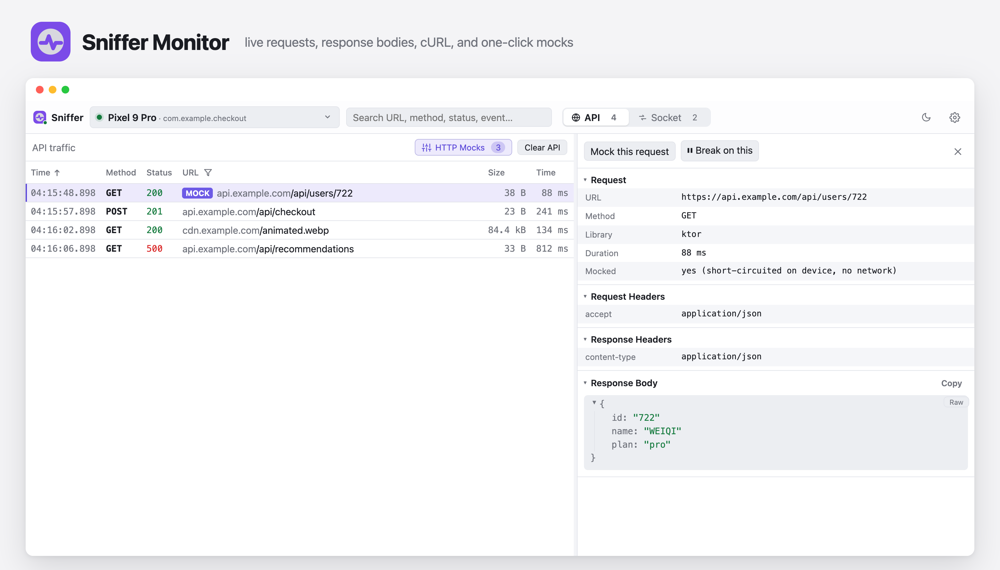

<h1 align="center">Sniffer</h1>

<p align="center">
  <a href="https://github.com/dev-weiqi/sniffer/tags"></a>
  <a href="https://www.npmjs.com/package/@dev-weiqi/sniffer"></a>
  <a href="https://central.sonatype.com/namespace/io.github.dev-weiqi.sniffer"></a>
  <a href="LICENSE"></a>
</p>

Sniffer is a Kotlin Multiplatform and native iOS SDK with a local monitor for inspecting and mocking mobile network traffic while you develop apps.

It supports **OkHttp**, **Ktor Client**, **URLSession**, **Socket.IO**, and **WebSocket**.



It keeps the [Flipper](https://github.com/facebook/flipper) workflow (connect a debug
app, watch traffic live, change behavior from a desktop UI) after Flipper was archived
and our setup hit the
[Android 16 KB page-size migration](https://developer.android.com/guide/practices/page-sizes).

## Install the monitor

The daemon runs on your dev machine. It serves the browser UI, stores mock rules and
keeps `adb reverse` alive for Android devices.

Requires [Node.js](https://nodejs.org) 20+, plus `adb` on your PATH for Android.

```bash
npm install -g @dev-weiqi/sniffer
sniffer start
```

The UI opens at [http://localhost:9091](http://localhost:9091). Without installing:

```bash
npx @dev-weiqi/sniffer start
```

If port 9091 is taken, Sniffer offers to free it, or pick another port:

```bash
PORT=9092 sniffer start
```

The daemon binds to `127.0.0.1` by default. Android (`adb reverse`), the iOS simulator
and a USB-connected iPhone reach it over `localhost`. Only a device on Wi-Fi needs it
opened up, together with `host` in the app (see [Start Sniffer](#start-sniffer)):

```bash
SNIFFER_BIND=0.0.0.0 sniffer start
```

Update, or pin a version:

```bash
npm install -g @dev-weiqi/sniffer@latest
npm install -g @dev-weiqi/sniffer@0.7.1
```

## Desktop app

A macOS build bundles the daemon and UI in one window, no Node.js needed. Download the
`.dmg` from [Releases](https://github.com/dev-weiqi/sniffer/releases)
(`Sniffer-server-mac-aarch64.dmg` for Apple Silicon, `Sniffer-server-mac-x64.dmg` for
Intel) and drag `Sniffer.app` into `/Applications`. The port is set in the app's settings.

The dmg is not notarized yet. If macOS says "Sniffer is damaged", clear the quarantine
flag once:

```bash
xattr -d com.apple.quarantine /Applications/Sniffer.app
```

## Add the SDK

Add `core` plus the modules for the clients you use. Use the `-noop` twins in release
builds: same API, empty implementation.

| Client | Sniffer artifact |
| --- | --- |
| OkHttp | `io.github.dev-weiqi.sniffer:okhttp` |
| Ktor Client | `io.github.dev-weiqi.sniffer:ktor` |
| Socket.IO | `io.github.dev-weiqi.sniffer:socketio` |
| Ktor WebSocket | `io.github.dev-weiqi.sniffer:ktor-ws` |
| Native iOS HTTP and WebSocket | Swift Package product `SnifferKit` |
| Native iOS Socket.IO | Swift Package product `SnifferSocketIO` |

```kotlin
val snifferVersion = "0.7.1"

dependencies {
    debugImplementation("io.github.dev-weiqi.sniffer:core:$snifferVersion")
    releaseImplementation("io.github.dev-weiqi.sniffer:core-noop:$snifferVersion")

    debugImplementation("io.github.dev-weiqi.sniffer:okhttp:$snifferVersion")
    releaseImplementation("io.github.dev-weiqi.sniffer:okhttp-noop:$snifferVersion")

    debugImplementation("io.github.dev-weiqi.sniffer:ktor:$snifferVersion")
    releaseImplementation("io.github.dev-weiqi.sniffer:ktor-noop:$snifferVersion")

    debugImplementation("io.github.dev-weiqi.sniffer:socketio:$snifferVersion")
    releaseImplementation("io.github.dev-weiqi.sniffer:socketio-noop:$snifferVersion")

    debugImplementation("io.github.dev-weiqi.sniffer:ktor-ws:$snifferVersion")
    releaseImplementation("io.github.dev-weiqi.sniffer:ktor-ws-noop:$snifferVersion")
}
```

For KMP shared code, add the modules to `commonMain`:

```kotlin
commonMain.dependencies {
    implementation("io.github.dev-weiqi.sniffer:core:$snifferVersion")
    implementation("io.github.dev-weiqi.sniffer:ktor:$snifferVersion")
    implementation("io.github.dev-weiqi.sniffer:ktor-ws:$snifferVersion")
}
```

### Connection to the daemon

The SDK owns its plain WebSocket connection to `localhost:9091`, using the same
socket and WebSocket primitives as its USB transport. Apps do not need to add a
Ktor client engine for Sniffer, and Sniffer does not register an engine that could
change the app's own `HttpClient()` selection. Android apps need the usual
`android.permission.INTERNET` permission.

## Start Sniffer

Start the SDK once at app launch. It reconnects on its own and never throws into your
app when the daemon is down.

```kotlin
import dev.weiqi.sniffer.core.Sniffer

class App : Application() {
    override fun onCreate() {
        super.onCreate()
        Sniffer.start(appId = packageName)
    }
}
```

The default `Sniffer.start(appId)` works everywhere except Wi-Fi:

| App runs on | Link | Setup |
|-------------|------|-------|
| Android device / emulator | `adb reverse` to `localhost:9091` | none (adb on PATH) |
| iOS simulator | `localhost:9091` (shares the Mac's loopback) | none |
| iPhone over USB | daemon dials the app through usbmuxd | none |
| Any device over Wi-Fi | app to your Mac's LAN IP | `SNIFFER_BIND=0.0.0.0` + `host` |

**iPhone over USB.** The SDK listens on the device's `127.0.0.1:9092` and the daemon
connects in through usbmuxd (built into macOS). The phone must be paired with this Mac
and the app in the foreground; it shows up within about 5 s. Set `SNIFFER_USB_PORT` on
both sides if 9092 is taken. Only Sniffer traffic uses the USB link, so `localhost` in
the app's own requests still means the phone.

Over Wi-Fi, pass your Mac's LAN address:

```kotlin
Sniffer.start(appId = "com.example.app", host = "192.168.1.20")
```

Or override at runtime without rebuilding:

```bash
adb shell setprop debug.sniffer.port 9092
adb shell setprop debug.sniffer.host 192.168.1.20
```

## Attach your clients

OkHttp:

```kotlin
import dev.weiqi.sniffer.okhttp.SnifferOkHttp

val okHttp = OkHttpClient.Builder()
    .addInterceptor(SnifferOkHttp.interceptor())
    .build()
```

Ktor client:

```kotlin
import dev.weiqi.sniffer.ktor.SnifferKtor

val ktor = HttpClient(CIO) {
    install(Auth) { /* ... */ }
    install(SnifferKtor) // install last, see below
}
```

> **Install `SnifferKtor` after every plugin that reacts to responses** (`Auth`, retry).
> A matched mock short-circuits the send chain, so plugins installed after Sniffer never
> see it. Installed last, a mocked 401 still triggers `Auth`'s token refresh.

Socket.IO:

```kotlin
import dev.weiqi.sniffer.socketio.SnifferSocketIO

val raw = IO.socket("https://api.example.com")
val socket = SnifferSocketIO.wrap(raw, "https://api.example.com")

socket.connect()
socket.emit("cart:update", mapOf("sku" to "pro"))
```

If your app multiplexes everything over one event, pass a `label` to `on`. It returns a
short tag shown as `event(tag)` in the UI; the real event name is still used for
listeners, the wire and mock matching. Return null for no tag:

```kotlin
socket.on("message", label = { args ->
    args.optJSONObject(0)?.optString("type")?.takeIf { it.isNotEmpty() }
}) { args ->
    // normal listener
}
// server sends: message {"type":"chat",...} → listed as message(chat)
```

Ktor WebSocket: install the plugin once and plain `webSocket` calls are monitored:

```kotlin
import dev.weiqi.sniffer.ktorws.SnifferKtorWs

val ktor = HttpClient(CIO) {
    install(SnifferKtorWs)
    install(WebSockets)
}

val session = ktor.webSocketSession("wss://api.example.com/realtime")
session.send("ping")
```

## Firebase panel (Beta)

Enable **Firebase · Beta** in the monitor's Settings to show the tab. It is hidden by
default and the preference is saved locally. Hiding the panel does not stop capture.
The panel shows only Analytics: explicit `logEvent` calls with their
event names and parameter snapshots in a timeline. **All users** is the default; choose **No user ID** or a specific ID
in the sidebar. **Include API** interleaves captured requests by their start time;
select a request to inspect headers, bodies, timing, and mock/breakpoint actions.
Nearby requests are context, not evidence that an event caused a request.

HTTP requests snapshot the current `SnifferAnalytics.setUserId` value when captured.
Pass the same identity changes your app sends to Analytics, including `null` to clear it. Legacy requests with no captured identity appear
only under **All users**, rather than being assigned to an anonymous user.
Search and user filters also apply to API requests. The **Name** filter includes or excludes case-insensitive partial names;
**From selection** adds the selected name, and right-click **Copy name** copies the displayed name.
Name filters are saved locally. **Clear Firebase**
clears Firebase records across all devices and keeps API requests.
The shared search field matches event names, parameter names and values (including nested data),
and user IDs using case-insensitive substrings. It combines with the Name and user filters.
Click events to expand their parameters inline; multiple events can remain open. Each parameter
row can be copied, and the collapse-all icon next to the record count closes all expanded events.
Matching names and values are highlighted. Newest events appear first, with a purple dot on the
latest visible record and a subtle entrance animation for new arrivals. Reduced-motion settings
use a fade without movement.

Wrap the Firebase instance in your existing event facade. Add `firebase` for debug and
`firebase-noop` for release, at the same Sniffer version as `core`. Keep your existing
Firebase Analytics dependency and BoM; Sniffer does not choose the host's Firebase version.

```kotlin
import com.google.firebase.Firebase
import com.google.firebase.analytics.analytics
import dev.weiqi.sniffer.firebase.SnifferFirebaseAnalytics

private lateinit var firebaseAnalytics: SnifferFirebaseAnalytics

fun init() {
    firebaseAnalytics = SnifferFirebaseAnalytics.wrap(Firebase.analytics)
}

fun track(eventId: String, params: Map<String, String>?) {
    firebaseAnalytics.logEvent(eventId) {
        params?.forEach { (key, value) -> param(key, value) }
    }
}

fun setUserId(id: String?) = firebaseAnalytics.setUserId(id)
```

Both `logEvent(name, Bundle?)` and `logEvent(name) { param(...) }` call the supplied Firebase
instance. The debug wrapper captures after Firebase's `logEvent` returns normally. The protocol records whether the SDK call returned normally, which is not cloud delivery
confirmation; use Firebase DebugView for received events. Original Firebase exceptions propagate normally; local capture errors
never prevent the Firebase call. The release wrapper forwards directly, with no Sniffer core
dependency and no capture code.

No extra start call, file path, or Timber tree is needed. Parameters preserve strings,
numbers, booleans, nulls, nested Bundles, and Bundle arrays/lists; oversized captures are marked
truncated. Only explicit wrapped calls appear, not Firebase's automatic events.
For KMP or local samples, `dev.weiqi.sniffer.core.SnifferAnalytics` accepts parameter maps;
without a Firebase callback, those events are marked **Local capture**. Both samples provide
Event, With params, and No user ID actions.

### Crashlytics compatibility

The existing Crashlytics SDK bridge and protocol remain available for older integrations,
but the Firebase panel only displays Analytics events. Analytics identity takes precedence for API correlation after it is set.

The bridge is included in `core` and `core-noop`; no Firebase dependency or cloud
credentials are added to Sniffer. It mirrors local app calls, not reports from the
Firebase console. Existing direct `FirebaseCrashlytics` calls must use the wrapper
below (or your app's logging facade) to appear in Sniffer.

Initialize Firebase first, then the bridge, then Sniffer:

```kotlin
// Android Application.onCreate(), after Firebase initialization:
SnifferFirebaseCrashlytics.start()
Sniffer.start(appId = packageName)
```

Forward your existing Crashlytics calls through the bridge:

```kotlin
import dev.weiqi.sniffer.core.SnifferFirebaseCrashlytics
import com.google.firebase.crashlytics.FirebaseCrashlytics

val crashlytics = FirebaseCrashlytics.getInstance()

fun recordException(error: Throwable) =
    SnifferFirebaseCrashlytics.recordException(error, crashlytics::recordException)

fun log(message: String) = SnifferFirebaseCrashlytics.log(message, crashlytics::log)
fun setUserId(id: String) = SnifferFirebaseCrashlytics.setUserId(id, crashlytics::setUserId)
fun setCustomKey(key: String, value: String) =
    SnifferFirebaseCrashlytics.setCustomKey(key, value) { k, v -> crashlytics.setCustomKey(k, v) }
```

The callbacks receive the original values and still run in `core-noop`, so switching
release builds to the no-op artifact does not disable Firebase reporting. Omitting a
callback records only in Sniffer; the sample apps use this mode and require no Firebase project.

On Android/JVM, the bridge chains the default uncaught exception handler and invokes
the existing handler (including Crashlytics). By default it uses memory only and writes
no files; fatal events that were not delivered before termination are lost.
To opt into replay after restart, pass an app-private directory such as
`SnifferFirebaseCrashlytics.start(filesDir.absolutePath)`. Pending fatal events are then
saved before invoking the existing handler and removed from disk when acknowledged.
Install after any other crash handler; call `SnifferFirebaseCrashlytics.stop()`
to detach. If the app already owns fatal handling, pass `captureUncaughtExceptions = false`
and call `SnifferFirebaseCrashlytics.recordFatal(error)` from that handler before delegating normally.
`recordFatal` does not terminate the app or call Firebase's non-fatal API.

For KMP on iOS, initialize with `SnifferFirebaseCrashlytics.start()`, and pass
your platform's Firebase calls through the same callbacks. Automatic iOS capture covers
unhandled **Kotlin** exceptions and preserves an existing Kotlin exception hook. Native
signals, Swift fatal errors, Objective-C exceptions and ANRs are not intercepted by this
bridge. Firebase's native crash reporting continues independently.

The SDK keeps the latest 20 unacknowledged fatal events (on disk only when opted in), 64 preceding logs and
64 custom keys. Non-fatal/log events use the existing 1000-message in-memory offline
queue and do not survive app termination. Daemon history remains in memory, like API
and Socket traffic; it is not a long-term crash archive. A process killed before its
exception handler can run cannot be captured.

## Use the UI

Open `http://localhost:9091`, launch your debug app and select the device.

- **API**: live requests and responses, headers, JSON, images, animated WebP, cURL copy,
  mocked entries.
- **Socket**: Socket.IO and WebSocket connections, events, payloads, acks and pushed
  server-to-client messages.
- **Firebase · Beta** (opt-in in Settings): Analytics events and inline parameters.
- **Mocks**: per-device HTTP response rules, delay-only rules, Socket.IO ack rules,
  WebSocket reply rules and push events.

Rules run inside the SDK on the selected device. HTTP mocks answer before the network;
socket ack rules answer locally. Mock bodies support `${randomId}`, `${now}` and
`${randomString(min~max)}`.

HTTP rules can combine **Query parameters** and JSON **Body conditions**. Every specified
condition must match; other object fields are ignored. **Mock this request** prefills the query
and complete JSON object body separately from the response. The device SDK must support the
selected conditions; update older SDKs before using body matching.

## Modules

| Artifact | Use it for |
| --- | --- |
| `io.github.dev-weiqi.sniffer:core` | SDK connection, device identity, mock rule sync |
| `io.github.dev-weiqi.sniffer:okhttp` | OkHttp inspection and HTTP mocks |
| `io.github.dev-weiqi.sniffer:ktor` | Ktor client inspection for Android, iOS and JVM |
| `io.github.dev-weiqi.sniffer:socketio` | Socket.IO inspection, ack mocks, push events |
| `io.github.dev-weiqi.sniffer:ktor-ws` | Ktor WebSocket inspection and reply mocks |

Each artifact has a `-noop` twin with the same API.

## Local development

```bash
npm run setup
npm start

cd client
./gradlew :sample:installDebug
./gradlew :sample-cmp:installDebug
```

Run client and server unit tests from the repository root:

```bash
npm test
```

Build checks from the repository root:

```bash
npm --prefix server/daemon run typecheck
npm --prefix server/ui run build
(cd client && ./gradlew :sample:compileDebugKotlin :sample-cmp:compileDebugKotlinAndroid)
```

More: [docs/GUIDE.md](docs/GUIDE.md) and [PROTOCOL.md](PROTOCOL.md).
